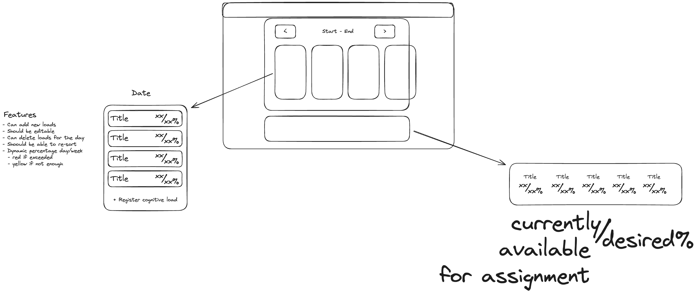

# Weekly Cognitive Load

# Cognitive Load

## Abstract

Schedule week by week your cognitive load to avoid burnout. Specify percentage of time you want to spend on each type of tasks and register the time you spend on each.

## Weekly Schedule

Use the previous configuration, opt-out so that you take action for the change you want to see in your life.

You schedule the cognitive load by the week and each day you register the time you spend on each type of task. The system will let you know if you are spending too much time on a specific type of task. Basically it will hold you accountable so that you keep yourself on track.

You can schedule cognitive load by the week.

## Daily Schedule

You can track your percentage by the day and get an estimate on how much you can spend on each type of task.

You can modify from today to the past every day, but you can not write the future. This tool will be most helpful if you use it every day.

Recomend a balanced distribution but allow for absolute recommendation

# Systemn Management

## Storage

Backend with index db and local storage, with a fallback to local storage if index db is not available.

## Endpoints

Mock Service Worker will be used to simulate the backend API. It will internally fetch the index db or local storage to get the data.

## Import and export

To allow for mutliple devices, the user will be able to import and export the data. The data will be stored in a JSON format.
